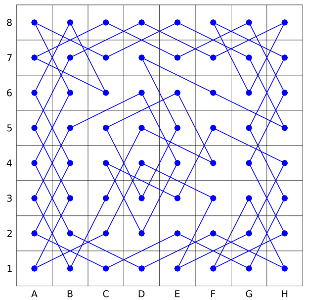
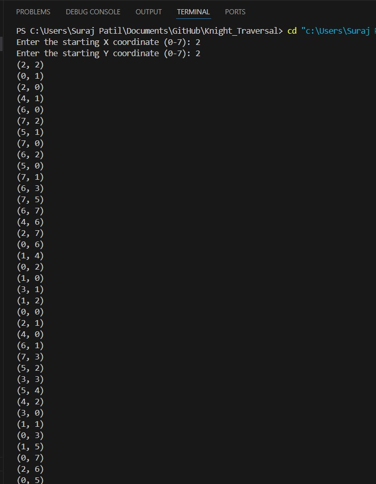

<h1><u>Knight Traversal Using C</u></h1>

<h2>Project Overview</h2>

This mini-project implements a solution to the Knight's Tour Problem using a backtracking algorithm. The goal of the project is to demonstrate how a knight piece can traverse every square on a chessboard exactly once, based on the knight's unique movement rules in chess.

<section>
<h2>Problem Description</h2>

The Knight's Tour problem involves finding a sequence of moves for a knight on a standard 8x8 chessboard, such that every square is visited exactly once. The knight moves in an "L" shape: it can move two squares in one direction (horizontal or vertical) and then one square perpendicular, or one square in one direction and then two squares perpendicular.

This project implements an algorithm that solves the Knight's Tour problem and outputs a solution where the knight visits all squares.

</section>

<section>
<h3>Key Features</h3>
<ul>
<li><u>Backtracking Algorithm:</u> The solution is based on backtracking, trying out every possible move and retracting if a dead-end is reached.</li>
<li><u>Chessboard Representation:</u> The chessboard is represented as an 8x8 grid where each cell is visited exactly once.</li>
<li><u>Solution Visualization:</u> A graphical representation of the knight's moves on the chessboard is generated, showing the path taken by the knight.</li>
</section>

<section>
<h3>Knight Tour</h3>

</section>

<section>
<h2>Output</h2>

</section>
